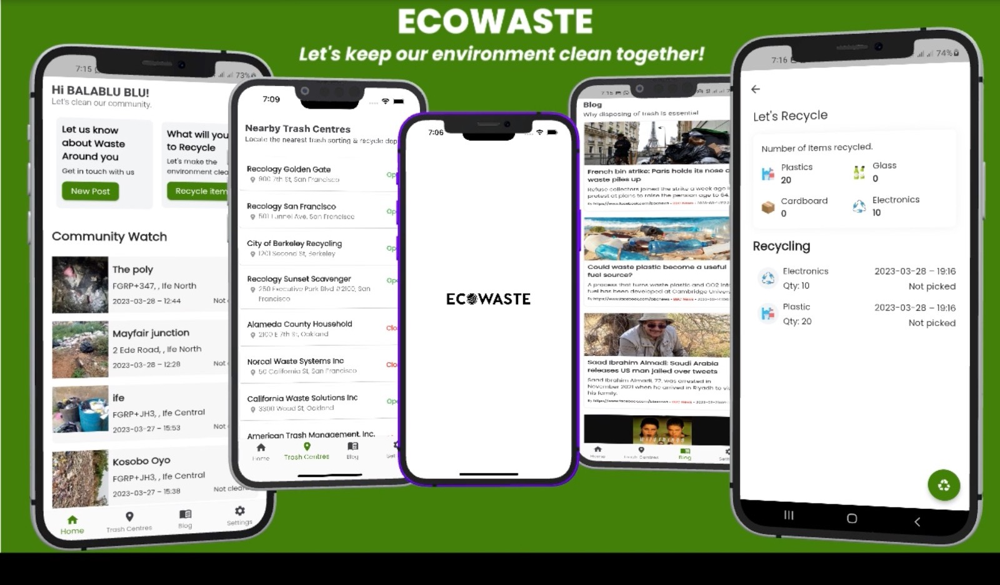

  <h1 align="left"> EcoWaste </h1>
<p align="left">A <b>Google DSC Solution Challenge</b> submission</p>.

<p align="left">Eco Waste is a platform built to build community participation in proper waste disposal and recycling. User's get access to report uncleared dump site within their environs and easily recycle items by posting on EcoWaste, making it accesseible to recycling companies to come pick up the items</p>

### Video Submission

Checkout our submission video below

<a href="http://www.youtube.com/">
                                                                                
</a>

### Project Info

The project contains two folder:

```
├───app
├───eco_web
```

App folder: contains the source code for the user app,
Eco_web: contains the source code for web app for waste companies,

Content in each foolder follows the sturcture below

```
├───controller
|
├───data
|
├───screens
|
├───services
│
└───utils
```

### Description

- The mobile and web platform was built with Flutter.
  Due to flutter cross-platform capabilities, we could
  target both android and ios with our single code base

- For the backend, we relied on Firebase, as it was easier to
  integrate with the flutter app

- For authentication we use Firebase_Auth to sign up user with
  with their email and a password.

- We leverage on firebase cloud for storing of waste captured
  images.

- For storing data including user data, commiunity watch post
  recycling post etc. we chose Cloud Firestore because of its robust
  features and ability to query & filter out documents with ease.

## Setup

##### Clone the repository

```bash
git clone https://github.com/Moshood-Kausar/eco_waste.git
```

##### Move to the desired folder

```bash
cd \eco_waste
```

##### Open up either the app or web project course code

```bash
cd \app
cd \eco_web
```

##### To run the app, simply write

```bash
flutter run
```

## About

Proper waste disposal is every essential to our environment. Hence the idea to build a solution that will help foster participation in safety of all

##### Made with ♥ by

[](https://github.com/Moshood-Kausar/eco_waste)
